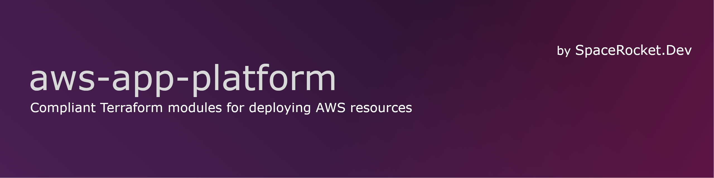

# ALB Module

This module provisions a production ready **public Application Load Balancer (ALB)** for ECS/Fargate style workloads.

It creates a dualstack, internet-facing ALB with an HTTP listener that redirects to HTTPS, an HTTPS listener with a configurable TLS policy and ACM certificate, an opinionated security group allowlist, and operational guardrails like access logging and 5xx alarms wired to SNS.

This module intentionally does **not** create target groups or listener rules for your applications. Downstream stacks (for example an `ecs-service` or `tg-fargate` module) should attach target groups and add listener rules using the exported listener and ALB outputs.

## What this module provisions

- Public ALB (`aws_lb`) with HTTP/2 enabled and dualstack addressing
- Listener `:80` redirecting to `:443`
- Listener `:443` using `lb_ssl_policy` and `main_cert_arn`
  - Default response is a fixed **403 Access denied** until downstream listener rules are added
- ALB security group:
  - Ingress `80`, `443`, and `8080` from `alb_config.public_ips` (IPv4) and `alb_config.public_ips_v6` (IPv6)
  - Optional ingress `80` and `443` from `alb_config.nat_gateway_eips` (useful when internal callers egress via NAT)
  - Egress allow all (IPv4 and IPv6)
- S3 bucket for ALB access logs (required encryption mode is **SSE-S3 / AES256**)
  - Lifecycle expiration for log objects
  - Bucket policy for ELB log delivery and regional ELB root account delivery
  - Public access block and ownership controls
  - Optional EventBridge notifications
- Optional separate S3 bucket for **server access logs** of the ALB logs bucket (auditing who accessed the ALB log bucket)
  - KMS encrypted, versioned, lifecycle managed
- CloudWatch alarms:
  - `HTTPCode_ELB_5XX_Count`
  - `HTTPCode_Target_5XX_Count`
  - Alarm actions published to `alb_config.alarm_sns_topic_arn`

## Inputs

This module uses a single composite input: `alb_config`.

At minimum you will provide:
- VPC and public subnets for the ALB attachment
- The ACM certificate ARN and TLS policy
- Access logs bucket name and prefix
- An SNS topic ARN for alarm actions
- A CIDR allowlist for inbound traffic

## Usage

### Example

```hcl
module "alb" {
  source = "./modules/alb"

  alb_config = {
    account_id  = local.base.account_id
    env         = local.base.env
    project     = local.base.project
    name_prefix = local.base.name_prefix
    aws_region  = local.base.aws_region

    vpc        = module.network.vpc
    lb_subnets = module.network.subnets_public

    lb_ssl_policy = "ELBSecurityPolicy-TLS13-1-3-FIPS-2023-04"
    main_cert_arn = var.cert_arn

    main_domain        = var.base_domain
    additional_domains = values(local.fqdn_map)

    # Optional Route53 aliases
    create_aliases = [
      for app, fqdn in local.fqdn_map : {
        name = fqdn
        zone = var.base_domain
      }
    ]

    # Ingress allowlists
    public_ips = {
      "203.0.113.10/32" = "Office"
      "198.51.100.0/24" = "VPN"
    }
    public_ips_v6 = {}

    # Optional: allow internal callers that egress via NAT
    natgw_count       = "one" # "none" | "one" | "all"
    nat_gateway_eips  = module.network.nat_gateway_eips

    # ALB access logs (ALB destination bucket must be SSE-S3 / AES256)
    logs_enabled             = true
    logs_prefix              = local.base.env
    logs_bucket              = local.logs_bucket
    logs_expiration          = 90
    logs_bucket_force_destroy = false

    # Optional: server access logging for the logs bucket (KMS encrypted)
    logs_access_enabled              = true
    logs_access_bucket               = null
    logs_access_prefix               = "s3-access-logs/"
    logs_access_expiration           = 365
    logs_access_bucket_force_destroy = false

    # Alarms
    alb_5xx_threshold    = 20
    target_5xx_threshold = 20
    alarm_sns_topic_arn  = module.sns_dev_alerts.topic_arn

    enable_deletion_protection = true
    common_tags                = local.base.common_tags
  }
}
````

### Notes

* The ALB access logs destination bucket **must** use **SSE-S3 (AES256)**. KMS is not supported for ALB delivery buckets.
* The HTTPS listener default action returns **403** until you add listener rules and target groups in a downstream module.
* If you set `nat_gateway_eips`, this module adds allow rules for those EIPs on ports `80` and `443`.
* `additional_domains` is informational. This module does not automatically request or attach additional ACM certificates.

## Related modules

* `modules/network` supplies the VPC, public subnets, and NAT gateway EIPs.
* `modules/tg-fargate` creates target groups and listener rules for services.
* `modules/ecs-service` typically consumes `listener_443_arn`, `alb_sg_id`, and ALB DNS outputs.
* `modules/sns` provides the SNS topic for ALB alarm notifications.

## Providers

| Name | Version |
|------|---------|
| <a name="provider_aws"></a> [aws](#provider\_aws) | 6.16.0 |

## Modules

No modules.

## Resources

| Name | Type |
|------|------|
| [aws_cloudwatch_metric_alarm.alb_5xx](https://registry.terraform.io/providers/hashicorp/aws/latest/docs/resources/cloudwatch_metric_alarm) | resource |
| [aws_cloudwatch_metric_alarm.target_5xx](https://registry.terraform.io/providers/hashicorp/aws/latest/docs/resources/cloudwatch_metric_alarm) | resource |
| [aws_kms_alias.alb_logs](https://registry.terraform.io/providers/hashicorp/aws/latest/docs/resources/kms_alias) | resource |
| [aws_kms_key.alb_logs](https://registry.terraform.io/providers/hashicorp/aws/latest/docs/resources/kms_key) | resource |
| [aws_lb.this](https://registry.terraform.io/providers/hashicorp/aws/latest/docs/resources/lb) | resource |
| [aws_lb_listener.default_80](https://registry.terraform.io/providers/hashicorp/aws/latest/docs/resources/lb_listener) | resource |
| [aws_lb_listener.default_app_443](https://registry.terraform.io/providers/hashicorp/aws/latest/docs/resources/lb_listener) | resource |
| [aws_route53_record.alias](https://registry.terraform.io/providers/hashicorp/aws/latest/docs/resources/route53_record) | resource |
| [aws_s3_bucket.logs](https://registry.terraform.io/providers/hashicorp/aws/latest/docs/resources/s3_bucket) | resource |
| [aws_s3_bucket.logs_access](https://registry.terraform.io/providers/hashicorp/aws/latest/docs/resources/s3_bucket) | resource |
| [aws_s3_bucket_lifecycle_configuration.logs](https://registry.terraform.io/providers/hashicorp/aws/latest/docs/resources/s3_bucket_lifecycle_configuration) | resource |
| [aws_s3_bucket_lifecycle_configuration.logs_access](https://registry.terraform.io/providers/hashicorp/aws/latest/docs/resources/s3_bucket_lifecycle_configuration) | resource |
| [aws_s3_bucket_logging.logs](https://registry.terraform.io/providers/hashicorp/aws/latest/docs/resources/s3_bucket_logging) | resource |
| [aws_s3_bucket_notification.logs_access_eventbridge](https://registry.terraform.io/providers/hashicorp/aws/latest/docs/resources/s3_bucket_notification) | resource |
| [aws_s3_bucket_notification.logs_eventbridge](https://registry.terraform.io/providers/hashicorp/aws/latest/docs/resources/s3_bucket_notification) | resource |
| [aws_s3_bucket_ownership_controls.logs](https://registry.terraform.io/providers/hashicorp/aws/latest/docs/resources/s3_bucket_ownership_controls) | resource |
| [aws_s3_bucket_ownership_controls.logs_access](https://registry.terraform.io/providers/hashicorp/aws/latest/docs/resources/s3_bucket_ownership_controls) | resource |
| [aws_s3_bucket_policy.alb_logs](https://registry.terraform.io/providers/hashicorp/aws/latest/docs/resources/s3_bucket_policy) | resource |
| [aws_s3_bucket_policy.logs_access](https://registry.terraform.io/providers/hashicorp/aws/latest/docs/resources/s3_bucket_policy) | resource |
| [aws_s3_bucket_public_access_block.logs](https://registry.terraform.io/providers/hashicorp/aws/latest/docs/resources/s3_bucket_public_access_block) | resource |
| [aws_s3_bucket_public_access_block.logs_access](https://registry.terraform.io/providers/hashicorp/aws/latest/docs/resources/s3_bucket_public_access_block) | resource |
| [aws_s3_bucket_server_side_encryption_configuration.logs](https://registry.terraform.io/providers/hashicorp/aws/latest/docs/resources/s3_bucket_server_side_encryption_configuration) | resource |
| [aws_s3_bucket_server_side_encryption_configuration.logs_access](https://registry.terraform.io/providers/hashicorp/aws/latest/docs/resources/s3_bucket_server_side_encryption_configuration) | resource |
| [aws_s3_bucket_versioning.logs](https://registry.terraform.io/providers/hashicorp/aws/latest/docs/resources/s3_bucket_versioning) | resource |
| [aws_s3_bucket_versioning.logs_access](https://registry.terraform.io/providers/hashicorp/aws/latest/docs/resources/s3_bucket_versioning) | resource |
| [aws_security_group.alb](https://registry.terraform.io/providers/hashicorp/aws/latest/docs/resources/security_group) | resource |
| [aws_security_group_rule.alb_443](https://registry.terraform.io/providers/hashicorp/aws/latest/docs/resources/security_group_rule) | resource |
| [aws_security_group_rule.alb_443_nat_eips](https://registry.terraform.io/providers/hashicorp/aws/latest/docs/resources/security_group_rule) | resource |
| [aws_security_group_rule.alb_443_v6](https://registry.terraform.io/providers/hashicorp/aws/latest/docs/resources/security_group_rule) | resource |
| [aws_security_group_rule.alb_80](https://registry.terraform.io/providers/hashicorp/aws/latest/docs/resources/security_group_rule) | resource |
| [aws_security_group_rule.alb_8080](https://registry.terraform.io/providers/hashicorp/aws/latest/docs/resources/security_group_rule) | resource |
| [aws_security_group_rule.alb_8080_v6](https://registry.terraform.io/providers/hashicorp/aws/latest/docs/resources/security_group_rule) | resource |
| [aws_security_group_rule.alb_80_nat_eips](https://registry.terraform.io/providers/hashicorp/aws/latest/docs/resources/security_group_rule) | resource |
| [aws_security_group_rule.alb_80_v6](https://registry.terraform.io/providers/hashicorp/aws/latest/docs/resources/security_group_rule) | resource |
| [aws_security_group_rule.alb_egress](https://registry.terraform.io/providers/hashicorp/aws/latest/docs/resources/security_group_rule) | resource |
| [aws_security_group_rule.alb_egress_v6](https://registry.terraform.io/providers/hashicorp/aws/latest/docs/resources/security_group_rule) | resource |
| [aws_iam_policy_document.alb_logs_s3](https://registry.terraform.io/providers/hashicorp/aws/latest/docs/data-sources/iam_policy_document) | data source |
| [aws_iam_policy_document.logs_access_policy](https://registry.terraform.io/providers/hashicorp/aws/latest/docs/data-sources/iam_policy_document) | data source |
| [aws_route53_zone.alias](https://registry.terraform.io/providers/hashicorp/aws/latest/docs/data-sources/route53_zone) | data source |

## Inputs

| Name | Description | Type | Default | Required |
|------|-------------|------|---------|:--------:|
| <a name="input_alb_config"></a> [alb\_config](#input\_alb\_config) | n/a | <pre>object({<br/>    account_id                = optional(string, "")<br/>    env                       = string<br/>    project                   = string<br/>    name_prefix               = string<br/>    aws_region                = string<br/>    vpc                       = any<br/>    lb_subnets                = list(any)<br/>    lb_sg                     = any<br/>    lb_ssl_policy             = string<br/>    main_domain               = string<br/>    additional_domains        = list(string)<br/>    logs_enabled              = bool<br/>    logs_prefix               = string<br/>    logs_bucket               = string<br/>    logs_expiration           = number<br/>    logs_bucket_force_destroy = bool<br/>    main_cert_arn             = string<br/>    create_aliases            = list(object({<br/>      name = string<br/>      zone = string<br/>    }))<br/>    common_tags            = map(string)<br/>    target_5xx_threshold   = optional(number, 20)<br/>    alb_5xx_threshold      = optional(number, 20)<br/>    alarm_sns_topic_arn    = string<br/><br/>    logs_access_enabled            = optional(bool, true)<br/>    logs_access_bucket             = optional(string, null)<br/>    logs_access_prefix             = optional(string, "s3-access-logs/")<br/>    logs_access_bucket_force_destroy = optional(bool, false)<br/>    logs_access_expiration         = optional(number, 365)<br/>    nat_gateway_eips               = optional(list(string), []) <br/>    logs_kms_key_arn               = optional(string, null)<br/>    enable_deletion_protection     = optional(bool, true)<br/><br/>    natgw_count = string # "none" | "one" | "all"<br/>    public_ips          = map(string)<br/>    public_ips_v6       = map(string)<br/>  })</pre> | <pre>{<br/>  "account_id": "",<br/>  "additional_domains": [],<br/>  "alarm_sns_topic_arn": "",<br/>  "alb_5xx_threshold": 20,<br/>  "aws_region": "us-east-1",<br/>  "common_tags": {<br/>    "Env": "dev",<br/>    "ManagedBy": "terraform",<br/>    "Project": "default"<br/>  },<br/>  "create_aliases": [],<br/>  "enable_deletion_protection": true,<br/>  "env": "dev",<br/>  "lb_sg": null,<br/>  "lb_ssl_policy": "ELBSecurityPolicy-TLS13-1-3-FIPS-2023-04",<br/>  "lb_subnets": [],<br/>  "logs_access_bucket": null,<br/>  "logs_access_bucket_force_destroy": false,<br/>  "logs_access_enabled": true,<br/>  "logs_access_expiration": 365,<br/>  "logs_access_prefix": "s3-access-logs/",<br/>  "logs_bucket": "default-dev-ecs-alb-logs",<br/>  "logs_bucket_force_destroy": false,<br/>  "logs_enabled": true,<br/>  "logs_expiration": 90,<br/>  "logs_kms_key_arn": null,<br/>  "logs_prefix": "dev",<br/>  "main_cert_arn": "",<br/>  "main_domain": "example.com",<br/>  "name_prefix": "myapp-dev",<br/>  "nat_gateway_eips": [],<br/>  "natgw_count": "none",<br/>  "project": "default",<br/>  "public_ips": {<br/>    "0.0.0.0/0": "Open"<br/>  },<br/>  "public_ips_v6": {<br/>    "::/0": "Open"<br/>  },<br/>  "target_5xx_threshold": 20,<br/>  "vpc": null<br/>}</pre> | no |

## Outputs

| Name | Description |
|------|-------------|
| <a name="output_alb_arn"></a> [alb\_arn](#output\_alb\_arn) | n/a |
| <a name="output_alb_dns_name"></a> [alb\_dns\_name](#output\_alb\_dns\_name) | n/a |
| <a name="output_alb_sg_id"></a> [alb\_sg\_id](#output\_alb\_sg\_id) | Security group id of the ALB |
| <a name="output_alias_zones_debug"></a> [alias\_zones\_debug](#output\_alias\_zones\_debug) | n/a |
| <a name="output_arn_suffix"></a> [arn\_suffix](#output\_arn\_suffix) | n/a |
| <a name="output_listener_443_arn"></a> [listener\_443\_arn](#output\_listener\_443\_arn) | n/a |

---

> [!TIP]
> #### Use SpaceRocket.Dev Open Source Terraform Modules for AWS
>
> Use SpaceRocket.Dev’s ready to use Terraform modules for AWS to get up and running fast, without sacrificing security, ownership, or clarity.
>
> ✅ Side by side implementation of this module in your AWS account with your team.<br/>
> ✅ Your team owns the code and the outcome.<br/>
> ✅ 100% Open Source Terraform with paid, hands on consultancy.<br/>
>
> <a href="https://spacerocket.dev"></a>
>
> <details>
> <summary>📚 <strong>Learn More</strong></summary>
>
> <br/>
>
> SpaceRocket.Dev is a solo DevSecOps consultancy based in San Francisco, CA; focused on helping teams build secure, compliant, production ready AWS platforms using Terraform as the source of truth.
>
> *Your team ships faster, with fewer surprises.*
>
> We combine open source Terraform modules with direct, senior level guidance. The code stays public and reusable. The expertise, context, and execution are delivered through consulting.
>
> #### Foundation for Production
> - **Reference Architecture.** A complete AWS foundation built using Terraform, designed to scale with your product and team.
> - **CI/CD Strategy.** Proven delivery patterns using AWS native tooling, focused on repeatability, auditability, and compliance readiness.
> - **Observability.** Practical visibility into infrastructure and workloads so issues are detected early and teams operate with confidence.
> - **Security Baseline.** Secure by default configurations aligned with SOC 2, FedRAMP, NIST 800 53, and Zero Trust principles.
> - **GitOps Workflow.** Infrastructure changes managed through pull requests, reviews, and approvals so everything stays in version control.
>
> <a href="https://spacerocket.dev"></a>
>
> #### Ongoing Operational Support
> - **Training.** Clear explanations of how and why the system is built so your team can run it independently.
> - **Direct Support.** Slack based access to the engineer who implemented the platform.
> - **Troubleshooting.** Fast help diagnosing and resolving real world issues.
> - **Code Reviews.** Practical feedback on Terraform, CI/CD, and security changes as your platform evolves.
> - **Bug Fixes.** Hands on remediation when improvements or fixes are needed.
> - **Migration Support.** Guidance and execution help when moving from legacy setups to Terraform driven infrastructure.
> - **Weekly Working Sessions.** Optional live sessions to review progress, answer questions, and plan next steps.
>
> <a href="https://spacerocket.dev"></a>
>
> </details>